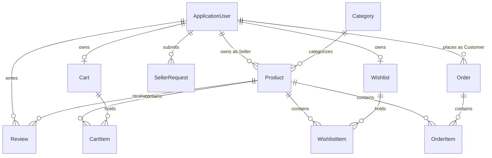

# AlaSaree3 — Secure Multi-Vendor E-Commerce Platform
### University Graduation Project (ASP.NET Core MVC Monolithic Web Application)

[](https://dotnet.microsoft.com/)
[](https://www.microsoft.com/sql-server)
[](https://learn.microsoft.com/ef/)
[]()
[]()

---

## 1. Project Description

**AlaSaree3** is a full-stack e-commerce marketplace that connects three types of users — Customers, Sellers, and
Administrators — in a single platform. Customers can browse and purchase products from multiple independent sellers,
sellers can manage their own storefronts and orders, and administrators oversee the whole marketplace (categories, users,
and seller approvals).
The application is built with ASP.NET Core MVC on .NET 9, using Entity Framework Core with SQL Server for data
access, and ASP.NET Core Identity with cookie-based authentication and role-based authorization (Customer, Seller,
Admin). Razor views styled with Bootstrap 5 and jQuery render the frontend directly from the server, following a
layered architecture where Controllers call Services (interfaces with implementations) that talk to the EF Core
DbContext, with dedicated ViewModels for each feature area.

---

## 2. Key Features

### Customer Experience
* **Catalog Browsing & Search**: Search products by name/keyword, filter by dynamic categories, and sort by Price (Ascending/Descending) or Newest arrivals.
* **Product Details & Ratings**: High-resolution imagery, real-time stock counters, average star ratings, detailed reviews, and seller storefront info.
* **Private Cart & Wishlist**: Isolated shopping carts with real-time stock validation and wishlist management with duplicate item prevention.
* **Atomic Checkout**: Transactional checkout preventing overselling and locking in purchase-time unit prices.
* **Order History & Cancellation**: Track order lifecycles (`Pending` → `Confirmed` → `Shipped` → `Delivered`) and cancel pending orders with automatic stock replenishment.
* **Purchase-Verified Reviews**: Customers can only review products they have genuinely purchased in completed orders.
* **Seller Application**: Apply to become a vendor with business details submitted for admin review.

### Seller Hub
* **Seller Dashboard**: Real-time sales revenue, product inventory counts, low stock alerts (< 5 items), and recent sales.
* **Product Management**: Full CRUD for own listings with safe image upload (magic byte verification).
* **Resource Ownership Security**: Sellers are strictly prohibited from viewing, editing, or deleting products belonging to other sellers.
* **Fulfillment Orders**: Isolated order views displaying only items belonging to the seller's storefront, with status transition capabilities.

### Administrator Command Center
* **System Metrics Dashboard**: Overview of total customers, total sellers, active listings, order counts, pending orders, and gross revenue.
* **User Governance**: View all platform users and toggle account statuses (`Active` / `Suspended`). Suspended accounts are immediately signed out.
* **Seller Application Moderation**: Review vendor applications, approve (assigning `Seller` role), or reject with feedback.
* **Category Management**: Create, edit, and safely delete categories (preventing deletion of categories containing active products).
* **Product Moderation**: Review all platform listings and remove non-compliant items.
* **System-Wide Order Tracking**: Monitor all orders across all sellers.

---

## 3. Technology Stack

* **Backend Framework**: ASP.NET Core 9.0 (MVC Monolith)
* **Language**: C# 13 / .NET 9
* **Database & ORM**: SQL Server / LocalDB (`(localdb)\mssqllocaldb`) with Entity Framework Core 9.0
* **Authentication & Identity**: ASP.NET Core Identity with custom `ApplicationUser` (`Status = Active | Suspended`)
* **Frontend**: Razor Views (.cshtml), ViewModels, HTML5, CSS3, JavaScript
* **UI Framework & Icons**: Bootstrap 5.3.3 & Bootstrap Icons 1.11.3
* **Testing**: xUnit, Moq, Entity Framework Core InMemory Database

---

## 4. Architecture

```text
AlaSaree3/
├── Controllers/
│   ├── HomeController.cs                // Catalog discovery, search, error handling
│   ├── AccountController.cs             // Identity registration, login, profile, access denied
│   ├── ProductController.cs             // Public product catalog and details
│   ├── CartController.cs                // Customer-isolated shopping cart
│   ├── WishlistController.cs            // Customer wishlist management
│   ├── OrderController.cs               // Transactional checkout and customer orders
│   ├── ReviewController.cs              // Purchase-verified customer reviews
│   ├── SellerController.cs              // Seller dashboard, product CRUD, and seller order fulfillment
│   ├── AdminController.cs               // Admin metrics, user suspension, seller request approval
│   ├── AdminCategoriesController.cs     // Category CRUD with safe-deletion checks
│   ├── AdminProductsController.cs       // Listing moderation
│   └── AdminOrdersController.cs         // System-wide order management
├── Models/                              // Core Domain Entities & Enums
├── ViewModels/                          // Strongly-typed ViewModels preventing overposting
├── Data/
│   ├── ApplicationDbContext.cs          // EF Core DbContext with fluent relationships & indexes
│   └── SeedData.cs                      // Automated database seeding runner
├── Services/
│   ├── Interfaces/                      // IProductService, IOrderService, ICartService, etc.
│   └── Implementations/                 // Business logic implementations
├── Middleware/
│   ├── SecurityHeadersMiddleware.cs     // CSP, X-Frame-Options, X-Content-Type-Options
│   └── UserStatusMiddleware.cs          // Suspended user validation on active sessions
├── Views/                               // Razor Views structured by feature area
├── wwwroot/
│   ├── css/site.css                     // Custom responsive styling
│   ├── js/site.js                       // Dynamic client interactions
│   └── images/products/                 // Product image assets and default placeholder
├── Migrations/                          // EF Core database migrations
├── Program.cs                           // Dependency Injection and HTTP Pipeline configuration
└── appsettings.json                     // Connection strings and seed configurations
```

---

## 5. Database Entities & Relationships



### Entity Summary
1. `ApplicationUser`: Extends `IdentityUser` with `FullName`, `Status` (`Active`/`Suspended`), `CreatedAt`.
2. `Category`: `Id`, `Name` (Unique Index), `Description`, `CreatedAt`.
3. `Product`: `Id`, `Name`, `Description`, `Price` (decimal 18,2), `AvailableQuantity`, `ImageUrl`, `CategoryId`, `SellerId`, `CreatedAt`.
4. `SellerRequest`: `Id`, `UserId`, `BusinessName`, `Reason`, `PhoneNumber`, `Status` (`Pending`/`Approved`/`Rejected`), `RequestedAt`, `ReviewedAt`.
5. `Cart` & `CartItem`: `CartId`, `CustomerId` (Unique Index), `ProductId`, `Quantity`.
6. `Wishlist` & `WishlistItem`: `WishlistId`, `CustomerId` (Unique Index), `ProductId` (Unique composite on `WishlistId + ProductId`).
7. `Order` & `OrderItem`: `OrderId`, `CustomerId`, `OrderDate`, `TotalAmount`, `Status`, `ShippingAddress`, `City`, `PostalCode`, `PhoneNumber`, `UnitPrice` (preserved at purchase time), `SellerId`.
8. `Review`: `Id`, `ProductId`, `CustomerId`, `Rating` (1-5), `Comment`, `CreatedAt` (Unique composite on `CustomerId + ProductId`).

---

## 6. Authentication & Roles

* **ASP.NET Core Identity**: Managed password hashing (PBKDF2), user storage, and claims authentication.
* **Role Hierarchy**:
  * `Admin`: Platform governance, category management, seller approvals, user suspension.
  * `Seller`: Storefront product CRUD, inventory management, fulfillment of own items.
  * `Customer`: Catalog browsing, cart, checkout, order tracking, verified reviews.
* **Registration Constraint**: Registration forms strictly assign the `Customer` role. No role parameter is accepted from the client.
* **Account Status**: `UserStatus.Active` vs `UserStatus.Suspended`. Suspended accounts cannot log in and are immediately signed out by `UserStatusMiddleware`.

---

## 7. Security Measures

1. **Resource Ownership Verification**: Every state-changing seller operation verifies `product.SellerId == currentUserId`. Order access verifies `order.CustomerId == currentUserId` or `item.SellerId == currentUserId`. Failed ownership checks return `403 Forbid`.
2. **Atomic Transactions & Anti-Overselling**: Checkouts run in database transactions with `RepeatableRead` isolation. Fresh inventory checks prevent overselling race conditions.
3. **Historical Unit Price Integrity**: `OrderItem` stores the exact `UnitPrice` at purchase time, safeguarding order history against future product price modifications.
4. **CSRF / Anti-Forgery Protection**: `[ValidateAntiForgeryToken]` applied to all state-changing POST requests.
5. **Overposting Defense**: Dedicated ViewModels prevent mass-assignment vulnerabilities on sensitive properties (`SellerId`, `Status`, `UnitPrice`, `Role`).
6. **SQL Injection Protection**: Parameterized LINQ queries via Entity Framework Core.
7. **XSS Protection**: Automatic Razor HTML output encoding.
8. **Secure File Uploads**: Uploaded product images are validated against allowed extensions (`.jpg`, `.jpeg`, `.png`, `.webp`), MIME types, 2MB size limit, and binary magic byte signatures to block disguised executables. Unique `Guid` filenames are generated.
9. **Authentication Cookie Security**: Configured with `HttpOnly = true`, `SameSiteMode.Lax`, `SecurePolicy = Always`, and 15-minute account lockout on 5 consecutive failed attempts.
10. **Security Headers**: Custom middleware injects `X-Content-Type-Options: nosniff`, `X-Frame-Options: SAMEORIGIN`, `Referrer-Policy: strict-origin-when-cross-origin`, and `Content-Security-Policy`.

## 8. Development Seed Accounts

The application automatically seeds roles, test accounts, categories, products, orders, and reviews upon first startup.

| Role | Email | Default Development Password |
|---|---|---|
| **Administrator** | `admin@alasaree3.com` | `Admin@Password123!` |
| **Seller (Tech Store)** | `techstore@alasaree3.com` | `Seller@123456!` |
| **Seller (Fashion Hub)**| `fashionhub@alasaree3.com` | `Seller@123456!` |
| **Customer (Alexander)**| `customer1@alasaree3.com` | `Customer@123456!` |
| **Customer (Sophia)** | `customer2@alasaree3.com` | `Customer@123456!` |


